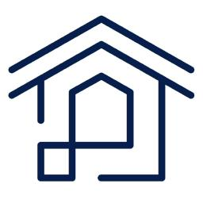

# Architectures compared

Both architectures run the same workload and produce external Delta tables with matching names.

  

    
    <strong>Databricks</strong>
    <small>Integrated managed platform</small>
  

  

    
    <strong>OpenLakehouse</strong>
    <small>Assembled open-source services</small>
  

  

    
    <strong>Lakeflow Jobs</strong><small>Managed workflow and task execution</small>
  

  
orchestration<b>↔</b>

  

    
    <strong>Apache Airflow</strong><small>DAG generated from the shared task graph</small>
  

  
↓

↓

  

    
    <strong>Databricks Runtime</strong><small>Serverless Apache Spark compute</small>
  

  
compute<b>↔</b>

  

    
    <strong>Apache Spark</strong><small>Standalone cluster through Spark Connect</small>
  

  
↓

↓

  

    
    <strong>Managed Unity Catalog</strong><small>Metadata, identity and governance</small>
  

  
catalog<b>↔</b>

  

    
    <strong>Unity Catalog OSS</strong><small>Metadata and catalog REST API</small>
  

  
↓

↓

  

    
    <strong>Databricks SQL / Spark</strong><small>Canonical TPC-H SQL</small>
  

  
SQL engines<b>↔</b>

  

    
    <strong>Spark, DuckDB, DataFusion</strong><small>Multiple engines over the same tables</small>
  

  
↓

↓

  

    
    <strong>External Delta tables</strong><small>Cloud object storage</small>
  

  
data<b>↔</b>

  

    
    <strong>External Delta tables</strong><small>SeaweedFS S3 in the local reference</small>
  

  

    <strong>Managed MLflow</strong><small>Experiment tracking</small>
  

  
ML lifecycle<b>↔</b>

  

    <strong>MLflow OSS</strong><small>Experiment tracking</small>
  

  

    <strong>Integrated governance</strong><small>Policies enforced across the platform</small>
  

  
governance<b>↔</b>

  

    
    <strong>Cedar + DataFusion</strong><small>Partial enforcement prototype</small>
  

## Tool mapping

| Capability | Databricks | OpenLakehouse | Comparison |
|---|---|---|---|
| Workflow orchestration | Lakeflow Jobs | Apache Airflow | Same task graph; different scheduler definitions and operational model |
| Batch compute | Databricks Runtime on serverless Spark | Apache Spark through Spark Connect | Shared PySpark logic; provisioning and lifecycle differ |
| Catalog | Managed Unity Catalog | Unity Catalog OSS | Core namespaces and external tables work; metadata and governance gaps remain |
| SQL analytics | Databricks SQL / Spark SQL | Spark SQL, DuckDB, DataFusion | All recorded Spark and DuckDB runs pass the 22 canonical queries |
| Table format | Delta Lake | Delta Lake OSS | Closest feature match in the tested workload |
| Object storage | Customer cloud storage | SeaweedFS S3 in the local reference | Same external-table design; SeaweedFS is a test-environment choice |
| ML tracking | Managed MLflow | MLflow OSS | Same public tracking API; service operations differ |
| Governance | Integrated Unity Catalog controls | UC OSS, Cedar and DataFusion prototype | Open enforcement is partial and not production-equivalent |

## Why this structure matters

Business transformations receive a Spark session and configuration; they do not select a platform. Storage paths, credentials, session creation, and scheduling stay in platform adapters. This boundary makes shared logic measurable and exposes the parts that really depend on a platform.

The comparison also uses independent checks. DuckDB recomputes table and Gold results, while a plain-Python implementation validates the SCD2 scenario. Agreement is therefore stronger evidence than running the same implementation twice.

## Important differences

Matching the task graph does not make the architectures equivalent. Databricks supplies an integrated control plane, managed compute, identity, governance, and operations. The open architecture assembles separate services, and its operator owns their integration, security, scaling, upgrades, and recovery.
