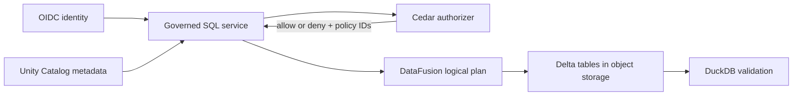

# Governance portability

Portability Challenge #4 uses **Cedar for authorization decisions** and **DataFusion
as the reference query enforcement point**. Unity Catalog remains the inventory
of catalogs, schemas, tables, columns, owners and tags. DuckDB remains an
separate query and validation engine; it is not replaced.

The model supports both **RBAC** and **ABAC**. Roles and group membership can be
represented as principal attributes, while policies can also evaluate principal,
resource and request-context attributes. Both approaches produce the same portable
decision contract: allow or deny, the matched policy IDs, and typed enforcement
obligations. Governance portability is included in the Portability Score as the
share of reviewed obligations that the DataFusion adapter currently enforces.
This deliberately narrow metric does not claim that identity integration or a
production governed SQL gateway is complete.

## Trust boundaries

Cedar answers whether a principal may perform an action on a resource in the
request context. It does not emit SQL. An allowing Cedar policy ID maps to a
reviewed, typed obligation such as `tenant_isolation` or `mask_email`. The
DataFusion adapter compiles those obligations into logical expressions. The
first implemented function is `mask_email`, which preserves the first local-part
character and domain (`alice@example.com` becomes `a***@example.com`), preserves
null, and fully masks malformed input:

| Layer | Responsibility |
|---|---|
| Identity provider | Authenticate the principal and issue trusted attributes |
| Unity Catalog OSS | Resource names, hierarchy, ownership and classification metadata |
| Cedar | Table and column authorization using principal, resource and context attributes |
| Obligation registry | Map reviewed policy IDs to portable row filters and masks |
| DataFusion gateway | Resolve every table, inject filters/projections/masks, execute the plan |
| Object storage | Accept credentials held by the gateway, not by the SQL client |

The contract is implemented in `portable_lakehouse.governance`, with a starting
Cedar schema, policies and obligation registry under `governance/`. It fails closed
when Cedar denies, reports an evaluation error, or returns an allowing policy
that has no obligation mapping. An engine adapter must never concatenate Cedar
source or an arbitrary policy string into SQL.

## Enforcement requirements

The production gateway must create plans only from catalog-resolved table
providers. Direct object-store URLs, external table DDL, unapproved UDFs and
unrestricted credentials must not be available to clients. Policy tests must
cover joins, aliases, CTEs, subqueries, metadata discovery and attempts to read
the same Delta location without its governed table name.

DataFusion is initially also included as a third Portability Benchmark engine. That
measures SQL and Delta portability; it does **not** by itself claim that the
benchmark process is a secure multi-user gateway.

## DuckDB

DuckDB continues to provide a separate result reference and trusted local
analytics. A future DuckDB adapter can consume the same typed obligations when
DuckDB is embedded behind a locked-down service. Giving a user an unrestricted
DuckDB connection or storage credentials bypasses that enforcement point, so it
is deliberately not the reference implementation.
